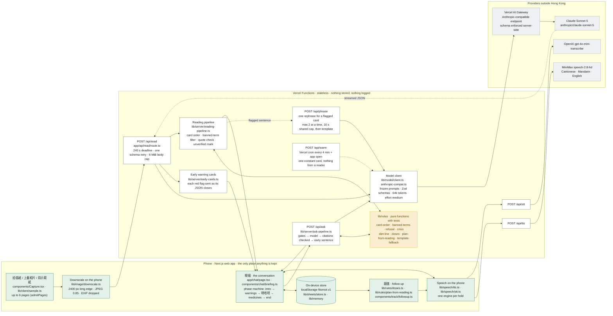
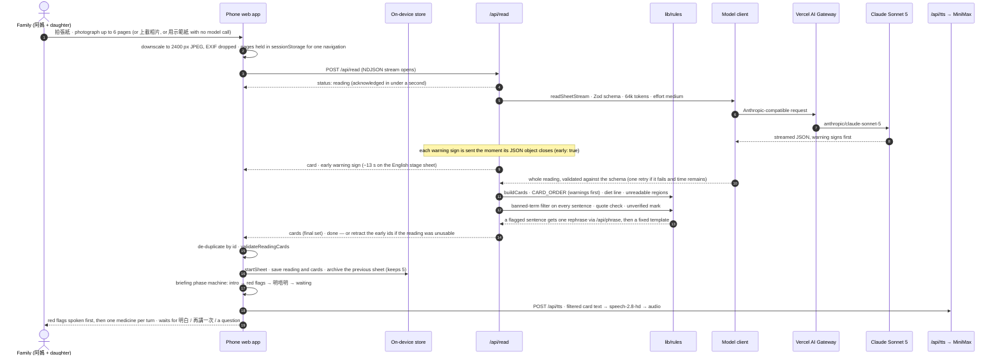
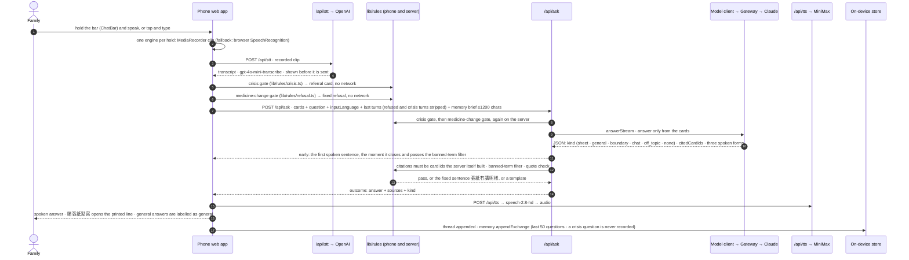
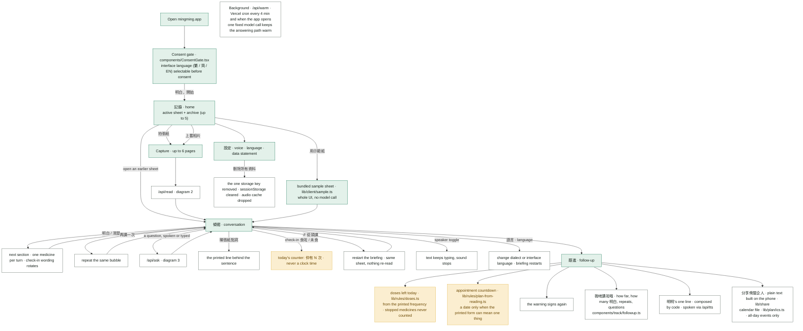

# Ming Ming · 明明 — the pipeline and every user flow, as Mermaid

Four diagrams, written from the code on `main` (5 September 2026). Paste any block into
[mermaid.live](https://mermaid.live), a Markdown viewer, or a slide tool that renders Mermaid.
File paths are the real ones so a judge can check any box against the repository.

## 1 · The pipeline: what runs where

**Who does what.** The model does two things: read the page into fields, copied verbatim, and write
the sentence a daughter would say, in three languages. Code decides everything else: the order,
every refusal, the filter, whether a citation is accepted, how many doses remain, which dates
reach the plan. ESLint forbids anything under `lib/rules` from importing the model.

## 2 · User flow: scan a sheet

## 3 · User flow: ask a question

## 4 · Every user flow, from opening the app

**Numbers on the deployed build, 5 September.** English stage sheet: first red flag spoken at 13 s,
full sheet 39 s. Traditional Chinese stage sheet: 49 s and 65 s. Questions 4 to 9 s warm; a refusal
under 1 s because no model is called. 1,405 unit tests, 122 browser tests, live question sets 20/20
in Cantonese and 20/20 in Mandarin with 0 banned terms.
