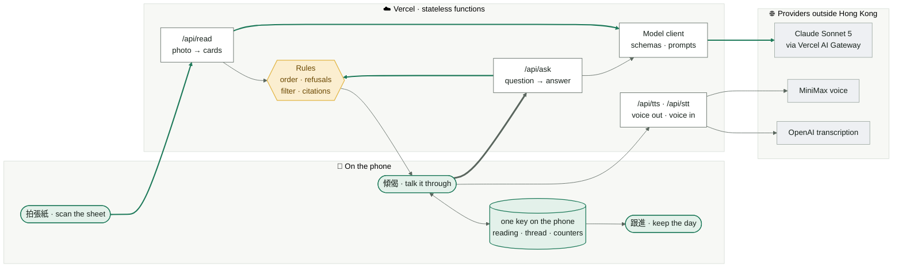
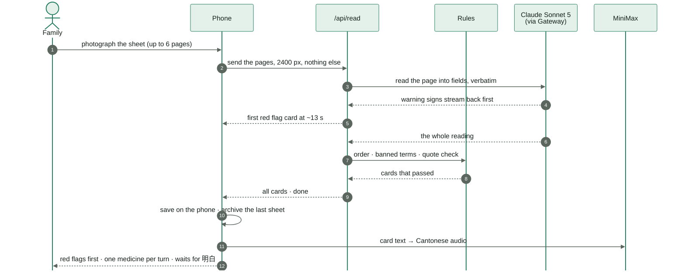
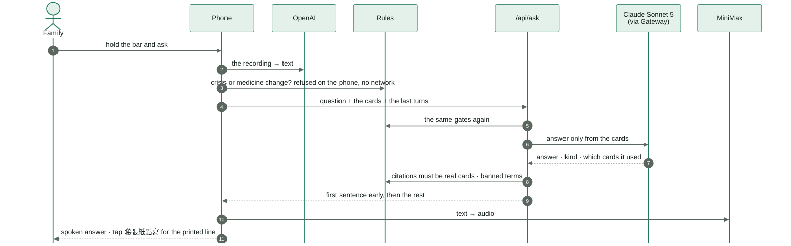
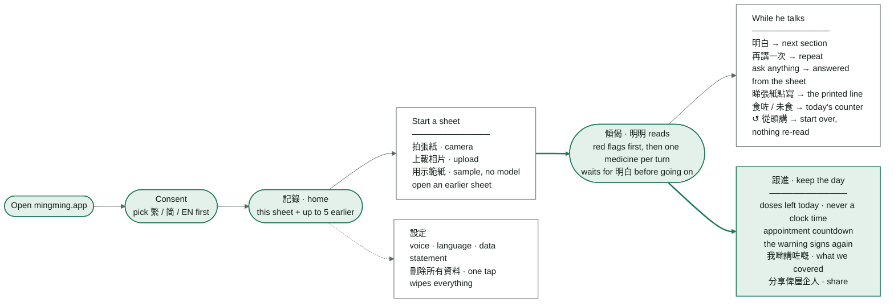

# Ming Ming · 明明 — the simple set

The same pipeline and flows as `pipeline.mermaid.md`, redrawn for slides: fewer boxes, short
labels, one colour per layer (green = on the phone, white = Vercel, amber = the rules, grey =
outside providers). File names live in the detailed set, not here.

## 1 · What runs where

Thick green arrows are the two main paths: a photo becoming cards, and a question becoming an answer.
Every card and every answer passes the rules box before the phone shows or speaks it.

## 2 · Scan a sheet

## 3 · Ask a question

## 4 · Every screen and action

Green pills are screens; white cards list what you can do there. Thick arrows are the path
the demo walks: start a sheet, hear it read, keep the day.
